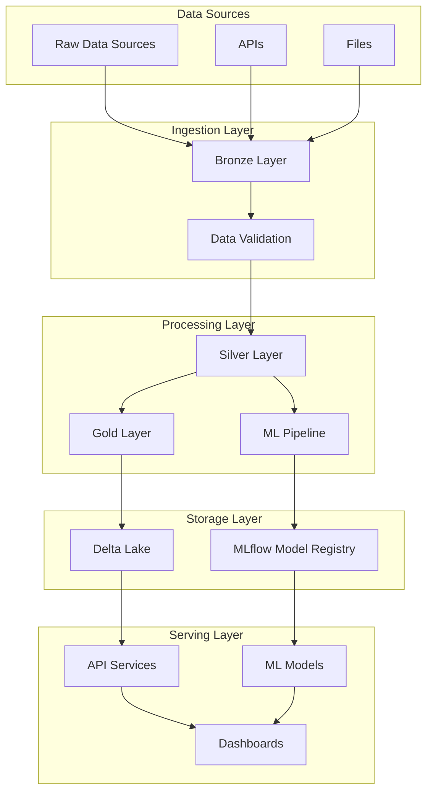

# System Architecture Overview

## High-Level Architecture

The Databricks Delta Lake project follows a modern data platform architecture with clear separation of concerns and scalable design patterns.



## Component Architecture

### 1. Data Ingestion (Bronze Layer)
- **Purpose**: Raw data ingestion and initial validation
- **Technology**: Apache Spark, Delta Lake
- **Location**: `scripts/data_processing/bronze_layer.py`
- **Features**:
  - Schema validation
  - Data quality checks
  - Raw data preservation
  - Incremental processing

### 2. Data Processing (Silver/Gold Layers)
- **Purpose**: Data transformation and business logic
- **Technology**: Apache Spark, Delta Lake
- **Features**:
  - Data cleaning and enrichment
  - Business rule application
  - Aggregation and summarization
  - Data lineage tracking

### 3. Machine Learning Platform
- **Purpose**: ML model development and deployment
- **Technology**: MLflow, scikit-learn, XGBoost
- **Features**:
  - Model training and validation
  - Experiment tracking
  - Model versioning
  - A/B testing

### 4. API Services
- **Purpose**: Data and model serving
- **Technology**: FastAPI, Python
- **Location**: `api/main.py`
- **Features**:
  - RESTful API endpoints
  - Authentication and authorization
  - Rate limiting
  - Health monitoring

### 5. Infrastructure Layer
- **Purpose**: Platform provisioning and management
- **Technology**: Terraform, Kubernetes, Docker
- **Features**:
  - Infrastructure as Code
  - Container orchestration
  - Auto-scaling
  - Monitoring and logging

## Data Flow Architecture

### Bronze Layer Processing
```
Raw Data → Schema Validation → Quality Checks → Bronze Tables
```

### Silver Layer Processing
```
Bronze Tables → Business Rules → Data Enrichment → Silver Tables
```

### Gold Layer Processing
```
Silver Tables → Aggregations → Business Metrics → Gold Tables
```

### ML Pipeline
```
Silver Tables → Feature Engineering → Model Training → Model Registry
```

## Technology Stack

### Core Technologies
- **Apache Spark**: Distributed data processing
- **Delta Lake**: ACID transactions and versioning
- **Python**: Primary development language
- **FastAPI**: API framework
- **MLflow**: ML lifecycle management

### Infrastructure
- **Terraform**: Infrastructure provisioning
- **Kubernetes**: Container orchestration
- **Docker**: Containerization
- **GitHub Actions**: CI/CD pipeline

### Monitoring & Observability
- **Prometheus**: Metrics collection
- **Grafana**: Visualization and dashboards
- **Structured Logging**: Application monitoring

## Security Architecture

### Authentication & Authorization
- **Databricks Personal Access Tokens**: API authentication
- **RBAC**: Role-based access control
- **Secrets Management**: GitHub Secrets for sensitive data

### Data Security
- **Encryption at Rest**: Delta Lake encryption
- **Encryption in Transit**: TLS/SSL for all communications
- **Data Masking**: PII protection
- **Audit Logging**: Comprehensive activity tracking

## Scalability Design

### Horizontal Scaling
- **Kubernetes HPA**: Auto-scaling based on metrics
- **Spark Cluster**: Dynamic resource allocation
- **API Load Balancing**: Multiple replicas

### Performance Optimization
- **Delta Lake Optimize**: File compaction and indexing
- **Caching**: Redis for frequently accessed data
- **Connection Pooling**: Efficient database connections

## Deployment Architecture

### Environment Strategy
- **Development**: Local development and testing
- **Staging**: Pre-production validation
- **Production**: Live system
- **Trial**: Databricks trial environment

### CI/CD Pipeline
- **Code Quality**: Automated linting and testing
- **Security Scanning**: Vulnerability detection
- **Infrastructure Validation**: Terraform and Kubernetes checks
- **Automated Deployment**: Environment-specific deployments

## Monitoring & Observability

### Metrics Collection
- **Application Metrics**: Custom business metrics
- **Infrastructure Metrics**: System resource usage
- **ML Metrics**: Model performance and drift

### Alerting
- **Critical Alerts**: System failures and errors
- **Performance Alerts**: SLA violations
- **Security Alerts**: Unauthorized access attempts

### Logging Strategy
- **Structured Logging**: JSON format for easy parsing
- **Log Levels**: DEBUG, INFO, WARNING, ERROR, CRITICAL
- **Centralized Logging**: Aggregated log collection

## Disaster Recovery

### Backup Strategy
- **Data Backups**: Delta Lake time travel
- **Configuration Backups**: Infrastructure state
- **Code Backups**: Git repository

### Recovery Procedures
- **RTO**: Recovery Time Objective < 4 hours
- **RPO**: Recovery Point Objective < 1 hour
- **Testing**: Regular disaster recovery drills

## Future Architecture Considerations

### Planned Enhancements
- **Streaming Processing**: Real-time data processing
- **Multi-Cloud**: Cross-cloud deployment
- **Advanced ML**: Deep learning integration
- **Data Mesh**: Decentralized data architecture

### Scalability Roadmap
- **Microservices**: Service decomposition
- **Event-Driven Architecture**: Asynchronous processing
- **Edge Computing**: Distributed processing
- **Serverless**: Function-based processing

---

*This architecture document is living documentation that evolves with the system.*
