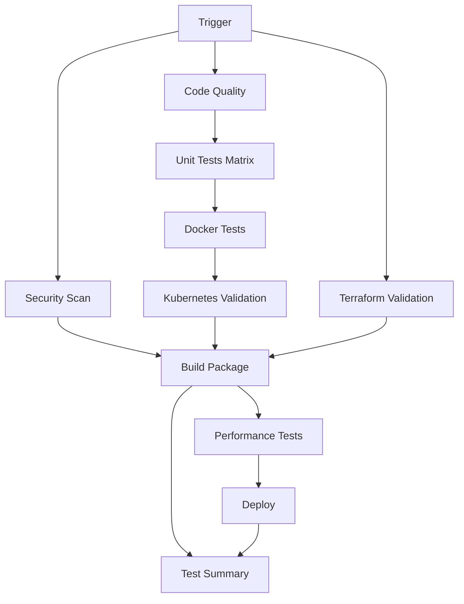

# CI/CD Workflow Documentation

## Overview

The Databricks Delta Lake project uses a comprehensive GitHub Actions workflow (`ci.yml`) that provides end-to-end testing, building, and deployment capabilities. This single workflow consolidates all CI/CD operations into one maintainable pipeline.

## Workflow Triggers

### Automatic Triggers
- **Push to main/develop**: Runs full pipeline including deployment
- **Pull Request to main**: Runs validation and testing (no deployment)
- **Daily Schedule**: Runs security scans at 2 AM UTC

### Manual Triggers
- **Workflow Dispatch**: Manual deployment to any environment
  - Available environments: `dev`, `staging`, `prod`, `trial`
  - Access via GitHub Actions tab → "Run workflow"

## Workflow Structure



## Jobs Breakdown

### 1. Code Quality (`code-quality`)
**Purpose**: Ensures code meets quality standards
**Dependencies**: None (runs first)
**Tools Used**:
- `flake8`: Linting and style checking
- `black`: Code formatting validation
- `isort`: Import sorting validation
- `mypy`: Type checking

**Key Features**:
- Caches pip dependencies for faster runs
- Fails fast on critical errors (E9, F63, F7, F82)
- Reports complexity and line length statistics

### 2. Unit Tests (`test`)
**Purpose**: Validates functionality across multiple Python/Java versions
**Dependencies**: `code-quality`
**Matrix Strategy**:
- Python: 3.10, 3.11 (Python 3.9 removed for performance optimization)
- Java: 11, 17 (Java 17 only with Python 3.11)

**Test Coverage**:
- Unit tests with pytest (5-minute timeout)
- Integration tests (conditional, 5-minute timeout)
- Coverage reporting to Codecov
- Environment-specific test configurations

**Performance Optimizations**:
- Job-level timeout: 30 minutes
- Individual test timeouts prevent hanging jobs
- Optimized dependency installation with caching
- Python 3.9 removed due to slow dependency resolution

### 3. Security Scan (`security`)
**Purpose**: Identifies security vulnerabilities
**Dependencies**: None (runs in parallel)
**Tools Used**:
- `safety`: Known vulnerability scanning
- `bandit`: Security linting
- `semgrep`: Advanced security analysis

**Outputs**:
- JSON reports for each tool
- Artifacts uploaded for review

### 4. Docker Tests (`docker-tests`)
**Purpose**: Validates containerization
**Dependencies**: `code-quality`
**Targets Built**:
- `development`: Dev environment with all tools
- `production`: Optimized production image
- `api`: FastAPI service container
- `data-processing`: Data pipeline container

**Validation**:
- Builds all target images
- Tests import functionality
- Validates container structure

### 5. Kubernetes Validation (`kubernetes-validation`)
**Purpose**: Ensures K8s manifests are valid
**Dependencies**: `docker-tests`
**Validations**:
- YAML syntax validation (using custom Python script)
- Offline validation without cluster connection
- Best practices checking
- Resource limit verification

**Key Features**:
- Uses `validate_yaml.py` script for reliable YAML validation
- No dependency on running Kubernetes cluster
- Validates all manifests in `infrastructure/kubernetes/`

### 6. Terraform Validation (`terraform-validation`)
**Purpose**: Validates infrastructure code
**Dependencies**: None (runs in parallel)
**Validations**:
- Format checking (`terraform fmt`)
- Syntax validation (`terraform validate`)
- Plan generation (dry run)
- Variable validation

### 7. Performance Tests (`performance`)
**Purpose**: Benchmarks and performance validation
**Dependencies**: None
**Trigger**: Only on push to main
**Tools**:
- `pytest-benchmark`: Performance benchmarking
- Baseline comparison
- Performance regression detection

**Timeout Configuration**:
- 10-minute timeout for performance tests
- Prevents hanging on long-running benchmarks

### 8. Build Package (`build`)
**Purpose**: Creates distributable package
**Dependencies**: All test jobs must pass
**Process**:
- Builds Python wheel and source distribution
- Validates package with `twine check`
- Uploads artifacts for deployment

### 9. Deploy (`deploy`)
**Purpose**: Deploys to Databricks environment
**Dependencies**: `build`, `performance`
**Trigger Conditions**:
- Push to main branch, OR
- Manual workflow dispatch

**Deployment Process**:
1. Downloads build artifacts
2. Installs Databricks CLI
3. Configures authentication
4. Uploads package to DBFS
5. Installs libraries on cluster
6. Runs deployment scripts

### 10. Test Summary (`test-summary`)
**Purpose**: Provides comprehensive test results overview
**Dependencies**: All jobs (runs regardless of status)
**Output**: GitHub Step Summary with:
- ✅ Passed jobs list
- ❌ Failed jobs list
- 📊 Overall status assessment

## Environment Configuration

### GitHub Secrets Required
```
DATABRICKS_HOST          # Databricks workspace URL
DATABRICKS_TOKEN         # Personal access token
DATABRICKS_CLUSTER_ID    # Target cluster ID
DATABRICKS_DEPLOYMENT_JOB_ID  # Deployment job ID
```

### Environment Variables
```yaml
PYTHON_VERSION: '3.11'   # Default Python version
JAVA_VERSION: '11'       # Default Java version
```

## Workflow Features

### Parallel Execution
- Independent jobs run in parallel for speed
- Dependencies ensure proper sequencing
- Failed jobs don't block unrelated work

### Conditional Execution
- Performance tests only on main branch
- Deployment only after all tests pass
- Environment-specific configurations

### Artifact Management
- Build artifacts preserved between jobs
- Security reports available for review
- Test coverage data uploaded to Codecov

### Error Handling
- Graceful failure handling in security scans
- Detailed error reporting
- Test summary shows overall status

## Usage Examples

### Manual Deployment to Trial Environment
1. Go to GitHub Actions tab
2. Select "Databricks Delta Lake CI/CD Pipeline"
3. Click "Run workflow"
4. Select "trial" environment
5. Click "Run workflow"

### Viewing Test Results
1. Go to Actions tab
2. Click on latest workflow run
3. Review individual job results
4. Check "Test Results Summary" for overview

### Debugging Failed Tests
1. Click on failed job
2. Review step-by-step logs
3. Download artifacts if available
4. Fix issues and push changes

## Best Practices

### For Developers
- Run `black`, `isort`, `flake8` locally before pushing
- Write tests for new functionality
- Update documentation for API changes
- Use meaningful commit messages

### For DevOps
- Monitor workflow performance
- Update dependencies regularly
- Review security scan results
- Maintain environment secrets

### For Code Review
- Check test coverage changes
- Review security scan results
- Validate infrastructure changes
- Ensure documentation updates

## Troubleshooting

## Recent Improvements (Latest Updates)

### Performance Optimizations
- **Python 3.9 Removal**: Eliminated Python 3.9 from test matrix due to slow dependency resolution
- **Timeout Configuration**: Added comprehensive timeout settings to prevent hanging jobs
  - Job-level timeout: 30 minutes
  - Unit tests: 5 minutes
  - Integration tests: 5 minutes  
  - Performance tests: 10 minutes
- **Dependency Caching**: Implemented pip cache for faster builds
- **Parallel Execution**: Optimized job dependencies for maximum parallelism

### Reliability Improvements
- **YAML Validation Fix**: Resolved Kubernetes validation connection errors
- **Custom Validation Script**: Created `validate_yaml.py` for offline YAML validation
- **Error Handling**: Improved error handling and reporting across all jobs
- **Dependency Resolution**: Optimized dependency installation process

### Code Quality Enhancements
- **Pydocstyle D212 Fixes**: Manually fixed all 51 docstring formatting issues
- **Perfect Pylint Score**: Achieved and maintained 10/10 pylint score
- **Type Checking**: Enhanced mypy configuration with strict type checking
- **Import Organization**: Improved import sorting and formatting

### Common Issues

#### Code Quality Failures
```bash
# Fix formatting
black utils/ scripts/ api/
isort utils/ scripts/ api/

# Fix linting
flake8 utils/ scripts/ api/ --max-line-length=88
```

#### Test Failures
- Check test logs for specific errors
- Verify test data and mocks
- Update tests for API changes

#### Security Scan Issues
- Review vulnerability reports
- Update dependencies if needed
- Address security findings

#### Terraform Validation Errors
```bash
# Fix formatting
terraform fmt -recursive infrastructure/terraform/

# Validate syntax
terraform validate infrastructure/terraform/
```

### Getting Help
- Check GitHub Actions logs
- Review this documentation
- Consult team members
- Check Databricks documentation

## Monitoring and Metrics

### Key Metrics to Track
- Workflow execution time
- Test pass/fail rates
- Security vulnerability trends
- Deployment success rates

### Alerts to Set Up
- Failed deployments
- Security vulnerabilities
- Performance regressions
- Infrastructure drift

## Future Enhancements

### Planned Improvements
- [ ] Add integration with external monitoring
- [ ] Implement automated rollback
- [ ] Add performance baselines
- [ ] Enhance security scanning
- [ ] Add deployment notifications

### Customization Options
- Modify matrix testing versions
- Add additional security tools
- Customize deployment environments
- Add custom validation steps

---

*Last updated: $(date)*
*Workflow version: 2.0*
