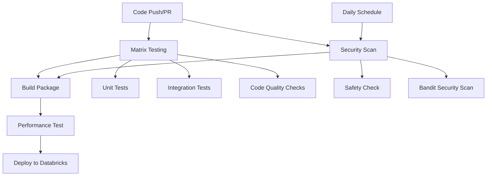

# CI/CD Pipeline Documentation

## Overview

This document describes the Continuous Integration and Continuous Deployment (CI/CD) pipeline for the Databricks Delta Lake project. The pipeline is implemented using GitHub Actions and provides automated testing, security scanning, building, and deployment capabilities.

## Pipeline Architecture



## Workflow Triggers

The pipeline is triggered by the following events:

### 1. Code Changes
- **Push to main branch**: Full pipeline including deployment
- **Push to develop branch**: Testing and building only
- **Pull Request to main**: Testing and building only

### 2. Scheduled Runs
- **Daily at 2:00 AM UTC**: Security scanning only

## Jobs Overview

### 1. Test Job (Matrix Testing)

**Purpose**: Comprehensive testing across multiple environments

**Matrix Configuration**:
- **Python Versions**: 3.9, 3.10, 3.11
- **Java Versions**: 11, 17 (Java 17 only with Python 3.11)

**Steps**:
1. **Environment Setup**: Python and Java installation
2. **Dependency Caching**: Speeds up builds by caching pip dependencies
3. **Dependency Installation**: Installs project dependencies with dev extras
4. **Code Quality Checks**:
   - **flake8**: Linting and style checking
   - **black**: Code formatting verification
   - **isort**: Import sorting verification
   - **mypy**: Type checking
5. **Unit Tests**: Runs tests in `testing/unit/` directory
6. **Integration Tests**: Runs tests in `testing/integration/` directory (Python 3.11 + Java 11 only)
7. **Coverage Reporting**: Generates and uploads coverage reports

**Artifacts**:
- Coverage reports (XML format)
- Test results

### 2. Security Job

**Purpose**: Automated security vulnerability scanning

**Tools Used**:
- **Safety**: Checks for known security vulnerabilities in dependencies
- **Bandit**: Scans Python code for common security issues

**Outputs**:
- `safety-report.json`: Dependency vulnerability report
- `bandit-report.json`: Code security analysis report

**Schedule**: Runs daily at 2:00 AM UTC

### 3. Performance Job

**Purpose**: Performance regression testing

**Triggers**: Only on pushes to main branch

**Tools**:
- **pytest-benchmark**: Performance benchmarking
- **Baseline Comparison**: Compares against performance baselines

**Outputs**:
- Performance benchmark results
- Baseline comparisons

### 4. Build Job

**Purpose**: Package building and validation

**Dependencies**: Requires test and security jobs to pass

**Steps**:
1. **Package Building**: Creates wheel and source distributions
2. **Package Validation**: Validates package integrity using twine
3. **Artifact Upload**: Stores build artifacts for deployment

**Artifacts**:
- `python-package-distributions`: Built packages (wheel and source)

### 5. Deploy Job

**Purpose**: Automated deployment to Databricks workspace

**Triggers**: Only on pushes to main branch

**Prerequisites**:
- Build job must complete successfully
- Performance job must complete successfully
- Requires production environment approval

**Steps**:
1. **Artifact Download**: Downloads built packages
2. **Databricks CLI Setup**: Configures Databricks CLI with authentication
3. **Package Upload**: Uploads wheel to DBFS
4. **Library Installation**: Installs package on target cluster
5. **Deployment Scripts**: Runs custom deployment scripts

## Configuration

### Environment Variables

The pipeline uses the following environment variables:

```yaml
env:
  PYTHON_VERSION: '3.11'  # Default Python version
  JAVA_VERSION: '11'      # Default Java version
```

### Required GitHub Secrets

For deployment functionality, the following secrets must be configured in your GitHub repository:

| Secret Name | Description | Required For |
|-------------|-------------|--------------|
| `DATABRICKS_TOKEN` | Databricks personal access token | Deployment |
| `DATABRICKS_HOST` | Databricks workspace URL | Deployment |
| `DATABRICKS_CLUSTER_ID` | Target cluster ID for deployment | Deployment |

### Setting Up Secrets

1. Go to your GitHub repository
2. Navigate to **Settings** → **Secrets and variables** → **Actions**
3. Click **New repository secret**
4. Add each secret with the appropriate value

## Project Structure Requirements

The pipeline expects the following project structure:

```
databricks-delta-lake-project/
├── .github/
│   └── workflows/
│       └── ci.yml
├── testing/
│   ├── unit/           # Unit tests
│   ├── integration/    # Integration tests
│   ├── performance/    # Performance tests
│   ├── security/       # Security tests
│   └── e2e/           # End-to-end tests
├── scripts/           # Project scripts
├── utils/             # Utility modules
├── pyproject.toml     # Project configuration
├── requirements.txt   # Dependencies
└── documentation/     # Documentation
```

## Test Configuration

### Pytest Configuration

The pipeline uses pytest with the following configuration (from `pyproject.toml`):

```toml
[tool.pytest.ini_options]
minversion = "7.0"
addopts = "-ra -q --strict-markers --strict-config"
testpaths = ["testing"]
python_files = ["test_*.py", "*_test.py"]
python_classes = ["Test*"]
python_functions = ["test_*"]
markers = [
    "slow: marks tests as slow (deselect with '-m \"not slow\"')",
    "integration: marks tests as integration tests",
    "unit: marks tests as unit tests",
    "e2e: marks tests as end-to-end tests",
    "performance: marks tests as performance tests",
    "security: marks tests as security tests",
]
```

### Test Markers

Use pytest markers to categorize your tests:

```python
import pytest

@pytest.mark.unit
def test_basic_functionality():
    """Unit test example"""
    pass

@pytest.mark.integration
def test_database_integration():
    """Integration test example"""
    pass

@pytest.mark.slow
def test_large_dataset_processing():
    """Slow test example"""
    pass

@pytest.mark.performance
def test_benchmark_processing_speed():
    """Performance test example"""
    pass
```

## Code Quality Standards

### Linting (flake8)

The pipeline enforces the following linting rules:
- **E9, F63, F7, F82**: Critical errors
- **Max complexity**: 10
- **Max line length**: 88 characters

### Code Formatting (black)

- **Line length**: 88 characters
- **Target versions**: Python 3.9, 3.10, 3.11

### Import Sorting (isort)

- **Profile**: black-compatible
- **Multi-line output**: 3
- **Line length**: 88 characters

### Type Checking (mypy)

- **Python version**: 3.9+
- **Strict mode**: Enabled for type safety
- **Ignore missing imports**: Enabled for external libraries

## Monitoring and Debugging

### Viewing Pipeline Results

1. **GitHub Actions Tab**: Go to your repository → Actions tab
2. **Workflow Runs**: Click on any workflow run to see detailed logs
3. **Job Details**: Click on individual jobs to see step-by-step execution
4. **Artifacts**: Download build artifacts and reports

### Common Issues and Solutions

#### 1. Test Failures
- Check test logs in the Actions tab
- Ensure test files follow naming conventions (`test_*.py`)
- Verify test dependencies are installed

#### 2. Security Scan Failures
- Review security reports in artifacts
- Update vulnerable dependencies
- Fix security issues flagged by Bandit

#### 3. Deployment Failures
- Verify GitHub secrets are correctly configured
- Check Databricks workspace connectivity
- Ensure cluster is running and accessible

#### 4. Build Failures
- Check `pyproject.toml` configuration
- Verify all dependencies are properly specified
- Review build logs for specific errors

### Performance Monitoring

- **Benchmark Results**: Available in performance job artifacts
- **Coverage Reports**: Uploaded to Codecov (if configured)
- **Build Times**: Monitor in GitHub Actions interface

## Customization

### Adding New Test Types

1. Create test directory: `testing/new_test_type/`
2. Add pytest marker: `new_test_type: marks tests as new test type`
3. Update workflow to include new test type

### Modifying Matrix Testing

Edit the matrix configuration in the workflow:

```yaml
strategy:
  matrix:
    python-version: ['3.9', '3.10', '3.11']
    java-version: ['11', '17']
    # Add new dimensions here
```

### Adding New Security Tools

1. Install tool in security job
2. Add scanning step
3. Configure output format
4. Upload results as artifacts

## Best Practices

### 1. Test Organization
- Keep unit tests fast (< 1 second each)
- Mark slow tests with `@pytest.mark.slow`
- Use appropriate test markers for categorization

### 2. Security
- Review security reports regularly
- Keep dependencies updated
- Follow secure coding practices

### 3. Performance
- Establish performance baselines
- Monitor for regressions
- Optimize critical paths

### 4. Deployment
- Use environment protection rules
- Test deployment scripts locally
- Monitor deployment success

## Troubleshooting

### Pipeline Not Triggering
- Check branch names match workflow configuration
- Verify workflow file is in `.github/workflows/`
- Ensure YAML syntax is valid

### Jobs Failing
- Review job logs for specific error messages
- Check environment setup and dependencies
- Verify test files and configuration

### Deployment Issues
- Confirm GitHub secrets are set correctly
- Test Databricks connectivity manually
- Check cluster status and permissions

## Support

For issues with the CI/CD pipeline:

1. Check the [GitHub Actions documentation](https://docs.github.com/en/actions)
2. Review workflow logs in the Actions tab
3. Consult the [Databricks CLI documentation](https://docs.databricks.com/dev-tools/cli/index.html)
4. Create an issue in the repository for persistent problems

## Changelog

| Version | Date | Changes |
|---------|------|---------|
| 1.0.0 | 2024-01-XX | Initial CI/CD pipeline implementation |
| 1.1.0 | 2024-01-XX | Added security scanning and performance testing |
| 1.2.0 | 2024-01-XX | Enhanced matrix testing and deployment automation |

---

*This documentation is maintained alongside the CI/CD pipeline. Please update it when making changes to the workflow configuration.*
